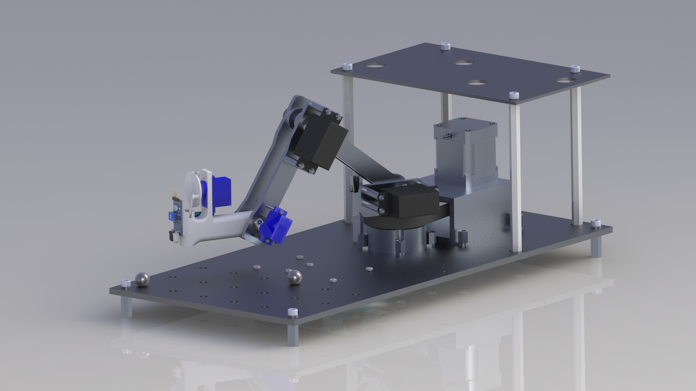
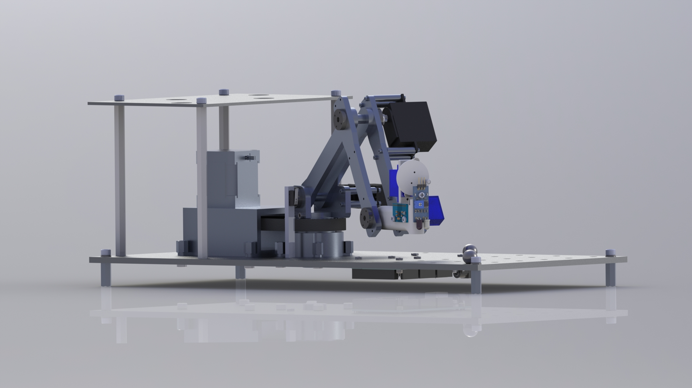
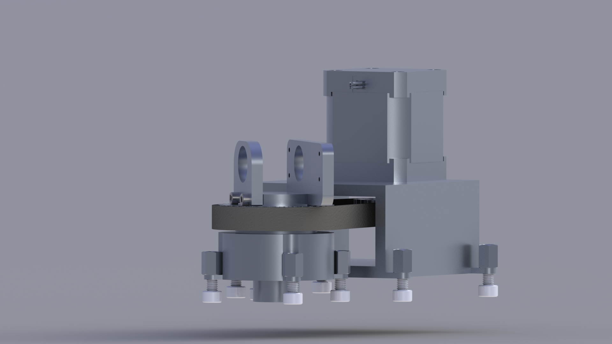
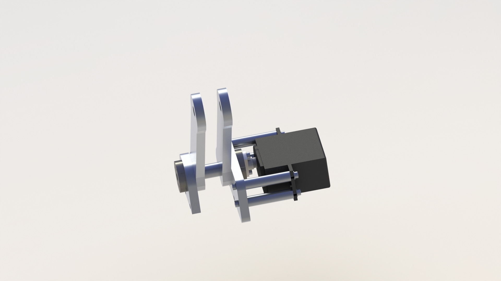
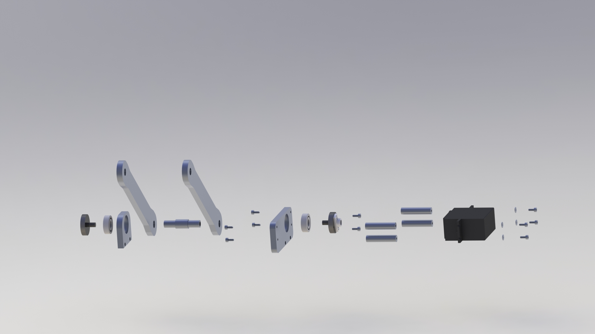
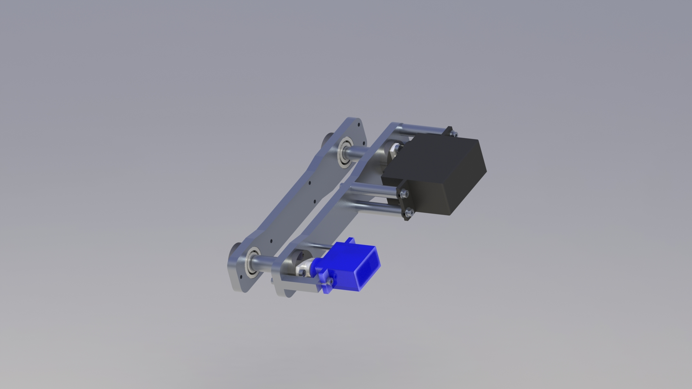
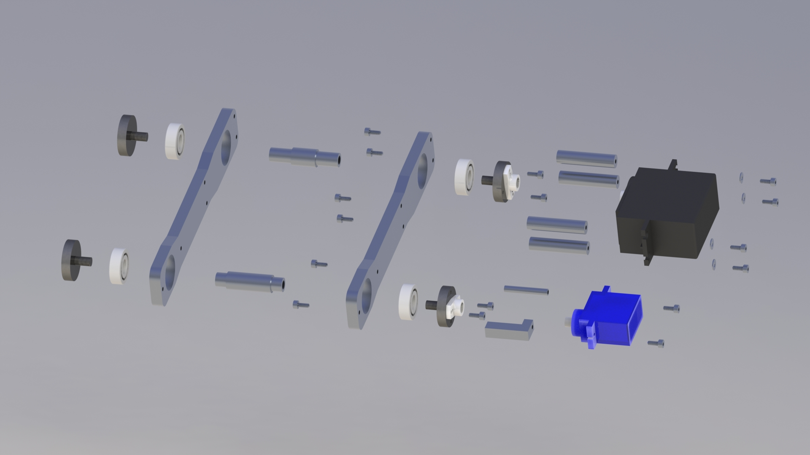
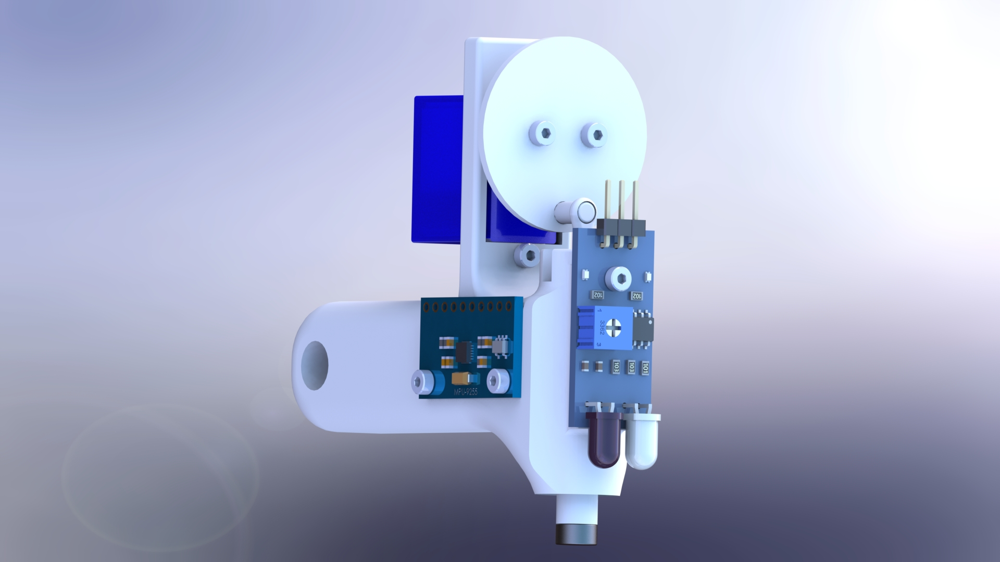
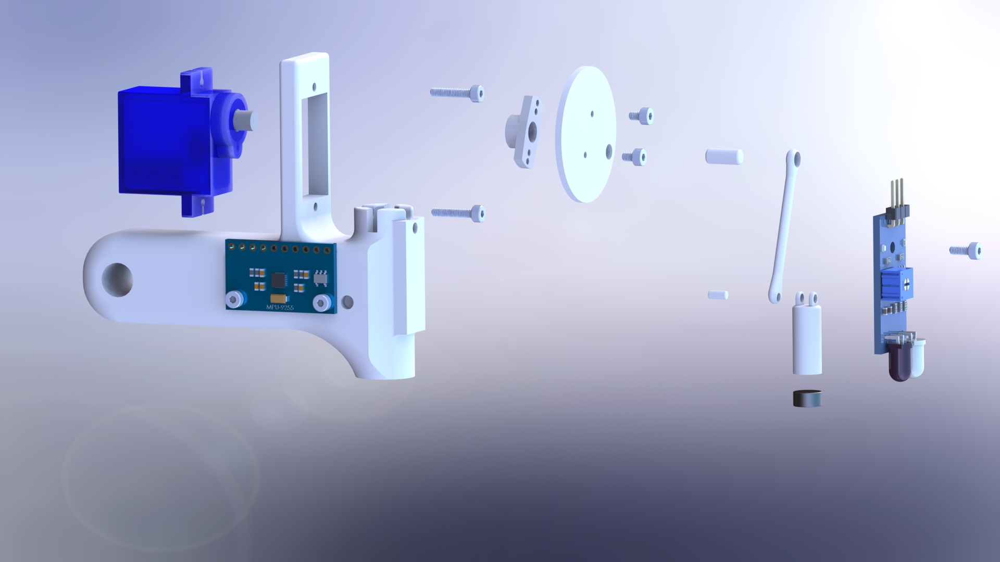

# Carson Andrijanoff - Design Portfolio
## I'm a Mechanical Engineering Student at The University of North Carolina Charlotte and this website is a repository for all of my interesting creative endeavors.

### **Solidworks Projects**
+ Junior Design - Pick and Place Robot  
    *Extensive Solidworks project to design physical components for an automated pick and place robot for my Spring 2021 Junior Design course.*
    *Full Model, component, and exploded views below. All components that are not fasteners, standoffs, servos, belt, accelerometer module, bearings, and IR sensor, were either created from scratch by me in Solidworks, or generated by my teammates for this project and heavily modified by me.*  
 
    Full PAP Robot Assembly - Robot was required to atonomously find one of four stainless steel balls and lift them up to the raised baseplate, dropping them through one of four holes. After finding and releasing each of the four balls through the holes, the robot will then halt and shut off.  
  
  
    This is the first rotary axis assembly of the robot. A stepper motor was required here by our professor. This stepper is connected to the rotating assembly at the base of the arm via a toothed timing belt. The gear ratio is 42:20 or approximately 2:1. This was chosen via a consideration of required torque to rotate this assembly vs the peak stall torque of this motor, and also the final degrees of resolution about the Z axis at the end of the arm.  
  
   This is rotary axis 2, the assembly that rotates the first arm section. This axis is direct driven by a Feetech FS6105R servo, keeping the design simple and compact. An exploded view of this assembly can be seen below.  
  
   Rotary Axis 3 follows the same design philosophy as Rotary Axis 2, direct drive servos mounted to custom arm bars. This time a TowerPro SG90 can be seen driving Rotary Axis 4 below.  
  
  
The Gripper sits at the end of the arm, and was required to use a crank-slider design to move a magnet to acquire each steel ball. Electronic component models were downloaded alongside the M2 fasteners. All other components were designed by myself in Solidworks.  
  
  
+ Cherry Style Keyswitch Model  
    *Recently experienced a hard drive loss - an image of a Linear Cherry MX style keyswitch assembly is below. Currently trying to recover these models however this is unlikely. Used Engineering Drawings from Cherry and Gateron to make a Solidworks assembly - all parts started from dimesnional values and generated by me.*
+ FSAE Student Suspension Development  
    *Developed a simplified model of an Ohlins TX25 MKII FSAE Damper, that prioritized the maximum outer dimensions of the design, to allow my team to utilize a one piece solid model - reducing computing demand for full vehicle assemblies and suspension specific assemblies on low power student laptops.*

### **KiCAD Project**
+ PCB Design for Custom 40% Mechanical Keyboard  
   *I am an avid Mechanical Keyboard enthusiast, as they exist at an interesting intersection between computers, mechanical, and electrical engineering. I decided that what I wanted in a compact keyboard layout wasn't quite available for sale, so I decided after seeing other community members make stunning keyboards - to take on designing my own. Using KiCAD and a mechanical keyboard pcb design guide - specifically this one made by Github User Ruiqimao https://github.com/ruiqimao/keyboard-pcb-guide - I learned how to use KiCAD at a proficient enough level to design my own PCB, baseplate, and switch plate for a mechanical keyboard. This board is a simple thru-hole soldering kit, requiring no PCB mounted electronics. All components are soldered to the board by the end user - a collection of 46 switches and diodes, along with an Arduino ProMicro, and you've got a working 40% compact keyboard - which I am using to make this website.*  
*Alongside KiCAD, I also learned how to make my own QMK based firmware for the board via a tutorial - https://beta.docs.qmk.fm/tutorial/newbs_building_firmware - and sucessfully verified the code's functionality. This firmware is now included in the QMK database such that anyone with one of my keyboard kits and an internet connection can assemble and flash the firmware to this board. I anticipate redesigning and updating the PCB design and keymap so that I can confidently offer an Interest Check to the community, and hopefully with enough interest arrange manufacturers and a Group Buy to sell my design!*  
